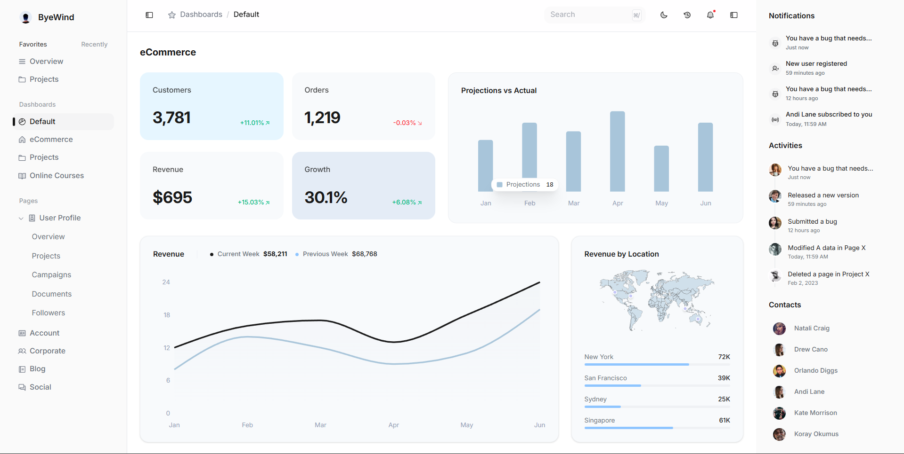
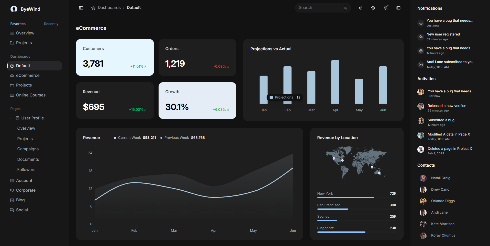
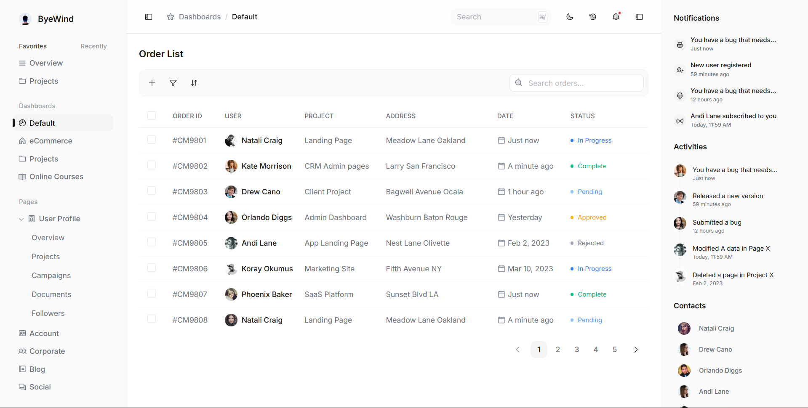

# Juspay - ByeWind Dashboard

[**View Live Demo**](https://juspay-assignment-kanak.netlify.app)

A premium, responsive eCommerce dashboard built with **React 19**, **Vite**, and **Tailwind CSS v4**. This project features a comprehensive dashboard with data visualizations and a robust order management system.

## Tech Stack

- **Framework**: [React 19](https://react.dev/) & [React Router](https://reactrouter.com/)
- **Build Tool**: [Vite](https://vitejs.dev/)
- **State Management**: [Redux Toolkit](https://redux-toolkit.js.org/)
- **Styling**: [Tailwind CSS v4](https://tailwindcss.com/)
- **Table**: [TanStack Table v8](https://tanstack.com/table/v8)
- **Charts**: [Recharts](https://recharts.org/)
- **Animations**: [Framer Motion](https://www.framer.com/motion/)
- **Icons**: [Lucide React](https://lucide.dev/), [React Icons](https://react-icons.github.io/react-icons/)
- **Components**: [Radix UI](https://www.radix-ui.com/)

## 📦 Getting Started

### Prerequisites

- Node.js (v18 or higher)
- pnpm (recommended) or npm/yarn

### Installation

1. **Clone the repository**:

   ```bash
   git clone https://github.com/kanakkholwal/juspay-assignment.git
   cd juspay-assignment
   ```

2. **Install dependencies**:

   ```bash
   pnpm install
   ```

3. **Start the development server**:

   ```bash
   pnpm dev
   ```

4. **Build for production**:

   ```bash
   pnpm build
   ```
## 📸 Screenshots

| Dashboard Light Mode | Dashboard Dark Mode |
|:---:|:---:|
|  |  |

| Orders Light Mode | Orders Dark Mode |
|:---:|:---:|
|  |  |

## Design Decisions & Architecture

### 1. State Management

I chose **Redux Toolkit** to handle the application's state like data fetched through APIs and shared across multiple components and application states like filters/pagination or sidebar open/close states.

While React's built-in `useState` and `useContext` are sufficient for small apps, Redux provides a more predictable state container for complex dashboards where multiple components (Sidebar, Navbar, Dashboard, OrderList) need to share and react to the same data.

It also simplifies api data fetching states using `createAsyncThunk` to manage loading, success, and error states in a standardized way.

### 2. Component-Level Responsiveness

Instead of relying solely on viewport-based media queries, I implemented **Tailwind Container Queries** (`@container`).

This allows components like the `StatCard` or `RevenueChart` to adapt their layout based on the size of their parent container (`Dashboard` component), making them truly modular and reusable in different layout contexts.

### 3. Data Table Architecture

For the `OrderList`, I integrated **TanStack Table** in a "headless" manner, meaning I only used its logic and state management capabilities without any pre-built UI components and also because I have used in other applications and familiar with it.

 This "headless" UI approach allowed me to maintain full control over the styling (using Tailwind) and custom column rendering while still leveraging features like multi-column sorting, global filtering, and pagination out of the box.

### 4. Micro-Interactions & Animations

I used **Framer Motion** for staggered entrance animations and smooth transitions between states.

This enhances the user experience by providing visual feedback during data loading, filtering, and navigation, making the dashboard feel more dynamic and responsive.

## Challenges & Solutions

- **Challenge**: Managing complex chart responsiveness in a grid layout on Dashboard main area.
  - **Solution**: Used `@container-queries` to adjust container-based grid layouts to ensure charts never overflow or break the layout.
- **Challenge**: Implementing a performant search across the order list.
  - **Solution**: Leveraged TanStack Table's built-in filtering logic with `useMemo` to ensure search operations are fast and don't cause unnecessary re-renders.

- **Challenge**: Dark Mode consistency across third-party libraries.
  - **Solution**: Custom CSS variables were mapped to Tailwind's theme, and dark mode variants applied to Radix UI components using `@custom-variant dark (&:where([data-theme="dark"], .dark, .dark *, [data-theme="dark"] *))`.

## Improvements Made

- **Skeleton Loaders**: Replaced basic "Loading..." text with polished skeleton screens or loader spinners that match the actual layout, reducing layout shift.
- **Custom Icon System**: Implemented a centralized SVG icon system for consistent branding and optimized loading.
- **Modular Slices**: Organized Redux state into feature-based slices (`dashboardSlice`, `ordersSlice`, etc.) for better maintainability.
- **Accessibility**: Used semantic HTML like `aside`,`main`, etc. and Radix UI primitives to ensure the dashboard is accessible to all users.
